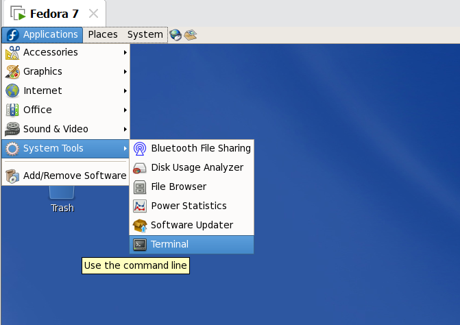

# SEU 2024年 操作系统专题实践课程实验

帖主当时在张竞慧老师班里，跟朋友询问得知该门课不同老师要求的实验内容其实是一样的。

本课程为实验课程，共安排三个综合实验，分别为：

-  实验1：Linux进程管理及其扩展；
-  实验2：Shell的实现；
-  实验3：文件系统的实现，其中实验3为选做。

将文件压缩包下载解压后导入自己的虚拟机中即可，以Ubuntu为例

详细步骤以及用户名和密码可邮箱咨询帖主：213223621@seu.edu.cn或者2153561406@qq.com

# 实验一

### 1.实验要求

 - (1).实现系统调用int hide(pid_t pid, int on)，在进程pid有效的前提下，如果on置1，进程被隐藏，用户无法通过ps或top观察到进程状态；如果on置0且此前为隐藏状态，则恢复正常状态。
 - (2).考虑权限问题，只有根用户才能隐藏进程。
 - (3).设计一个新的系统调用int hide_user_processes(uid_t uid, char *binname)，参数uid为用户ID号，当binname参数为NULL时，隐藏该用户的所有进程；否则，隐藏二进制映像名为binname的用户进程。该系统调用应与hide系统调用共存。
 - (4).在/proc目录下创建一个文件/proc/hidden，该文件可读可写，对应一个全局变量hidden_flag，当hidden_flag为0时，所有进程都无法隐藏，即便此前进程被hide系统调用要求隐藏。只有当hidden_flag为1时，此前通过hide调用要求被屏蔽的进程才隐藏起来。（选做）
 - (5).在/proc目录下创建一个文件/proc/hidden_process，该文件的内容包含所有被隐藏进程的pid，各pid之间用空格分开。（选做）

### 2.具体实现

​    

1. **切换内核，这个很重要！！！！**fedora会用系统内置的默认内核，而不是已经编译好的那个，在开机的时候按住enter，然后等到进入一个倒计时的界面时再按一下enter，进入内核切换页面

   

   实测更方便的方法是一直按着向上的方向键，然后就很容易进入这个切换界面，方向键切换至上面的，按enter进入系统

   

2. 在seu's home中两个文件hide_user.c和hide_user_processes.c，对应两个必做的测试文件，都需要在管理员模式下运行（实验一有要求，只有管理员才可以修改）

3. 打开一个terminal终端，并进入管理员模式，该终端用来执行测试文件（终端位置如图  

   

4. 再打开一个terminal终端，进入后输入top-u seu，用来监看进程状态，这个terminal会实时显示用户下的所有进程，这个terminal是方便你看，自己的测试脚本有没有起作用的

   

   

5. 现在可以将两个终端按下图排列，方便后续描述。

   

   

6. 在上面的终端中输入gedit hide_test.c，用来打开第一个实验的测试代码，并且可以修改(该终端是管理员模式，所以可以直接访问受保护文件)

   

   有两个参数，pid和on，pid是你需要隐藏的进程的进程号，on可以设置为0或1，分别对应的是隐藏或不隐藏

   在这里比如设置pid为4000，然后保存退出

8. 在终端中输入gcc hide_test.c  -o hide_test，用于将刚刚修改过的.c文件编译成可执行文件、

9. 然后./hide_test执行脚本，观察下方的4000进程是否存在，

   

   发现4000进程还是存在的，回到第五步将on改为1，保存退出后再次执行6、7步观察4000进程是否还存在

   

   可以看到4000进程消失了，实验一的第一个必做实验算是成功了，记得将on复原成0，如果不管on为0还是为1，进程都没隐藏的话，说明你开机的时候没切换内核，fedora会用系统内置的默认内核，而不是已经编译好的那个，所以使用虚拟机的重启，重复步骤1，另外，如果你还不确定自己有没有进到编译过的内核的话。输入uname -r，如果输出版本是不带后缀的那个，说明进对内核了

   

10. 直接执行./hide_user_test看看进程表有什么变化

   

   发现进程表直接清空了，这就是实验一要验收的第二个内容，隐藏指定用户所有进程

   

11. 终端输入gedit hide_user_test.c，运行发现里面有两个变量，uid和recover，uid对应要隐藏进程的用户id，里面的500对应的是你的用户seu，recover分使分别取0或1，对应隐藏或者不隐藏

    

12. 将recover改为1，保存退出，输入gcc hide_user_test.c -o hide_user_test将其编译成可执行文件，然后输入./hide_user_test运行观察进程表有什么变化。

    

    发现进程表又出现，新系统调用测试通过

    到这里实验一第二个验收其实已经ok了，但是还有两个选作要顺着第二个内容做下去。

    

13. 将recover设为0，也就是隐藏状态

14. 输入cd /proc，然后执行echo "0" > hidden，观察有什么效果

    

    发现之前隐藏的进程又全部出现了

    

15. 然后输入echo "1" > hidden，观察结果

    

    发现进程又全部隐藏了，这就是实验一第一个选作的验收，设置了一个全局变量hidden，当hidden为1的时候，对其他实验没有影响，但是当hidden为0时， “隐藏进程”这件事本身，被禁止了。也就是说，当hidden=0时，第一个测试代码和第二个测试代码都会完全失效，进程无法被隐藏

    

16. 最后是第二个选做，先echo "0" > hidden，给已有的进程截个图或者手机拍个照，记录下来之后再echo "1" > hidden回去，然后cat hidden_process，观察输出结果，发现全都是进程号，对比发现就是进程表中的进程号，这是第二个选做内容，当进程被隐藏时，有一个全局变量hidden_process，也不能算是全局变量，应该说是文件，这个文件会在进程被隐藏时，存储所有已经被隐藏的进程号，之前让你拍照是让你对应一下，确定隐藏的是你seu的进程，不过这个确定聊胜于无，到这里，实验一算正式验收完了。

    或者更简单一点，直接是echo "1" > hidden，然后cat hidden_process，再echo "0" > hidden，将cat hidden_process后打印出的进程号与下方的进程表中相对比

    

  

# 实验二

### 1.实验要求

实现具有管道、重定向功能的shell，能够执行一些简单的基本命令，如进程执行、列目录等。

### 2.具体实现

1. 打开一个terminal ，su进入管理员模式，然后cd到Lab2，同时手动打开Lab2文件夹

   

2. 里面有两个可执行文件，test_shell和test_shell2

3. 先执行./test_shell，然后你会发现自己进了一个自己做的shell里，在这个自己做的shell里输入，ls > hope.txt，hope.txt想起什么名字起什么名字，随便想的，

4. 观察是否有一个hope.txt出现，打开并观察文件内容，

   

   

   

   这个是一个验收点，重定向输出，ls指令肯定不陌生，输出当前路径下的所有文件，ls > hope.txt，含义是把ls的输出结果，写入到hope.txt这个文件中

   

5. 接下来是第二个验收点，重定向输入，Ctrl+C退出管道操作，输入wc -m < hope.txt，观察输出结果

   

   wc -m这个指令，用来检测输入内容当中有多少个字符，wc -m < hope.txt，就是把hope.txt这个文档的内容作为输入，然后检测这个文档中有多少字符，这是第二个验收点了

   

6. 第三个验收点是管道功能，执行ps aux | grep notification，观察输出结果

   

   ps aux，是一个静态的查询所有的进程，和top -u seu差不多，但是ps aux是一次性把所有用户的进程全部列举出来，包括管理员root，grep notification，是在一段文本当中，查询包含"notification"关键字的词条，什么叫管道，执行ps aux | grep notification，就是我把左边的指令的输出，当作了右边指令的输入，所以综合效果就是，输出含“notification”关键字的进程，也可以试试ps aux | grep notification > 随便一个名字.txt，也会把这个输出结果写入到那个txt中，这个是管道的验收

   

   到这里，及格肯定是不成问题的

7. 但其实实验二还差了一个小点，这个点有的老师会验收，有的老师不会验，可以试试，在你现在的这个shell里(重新执行./test_shell)，执行echo "hello" >> hope.txt

   

   发现hope文件空白了，而且shell里应该也报错了，重定向的基础功能，输入输出已经验收过了，来解释一下，基础功能已经实现了，但是当我们使用 > XX.txt时，这种写入文件的方法是覆写，即，我会把那个文件先清空，然后再写入我的内容，而>>，你刚才用fedora自己的shell也看到了（即不是在运行test_shell之后运行，直接运行echo "hello" >> hope.txt，结果是在hope文档中最后一行多了一个hello)，是追加往后写了一个hello，这个是第四个验收点，追加，这个点有的老师验收，有的老师不验

8. 为什么我在Lab2写了两个test_shell，因为，test_shell，是没有追加功能的，你现在也可以去试试开一个新的terminal，然后执行test_shell2，test_shell2本身也有问题。，test_shell2能实现重定向，也能实现追加，但是没有实现管道。所以我推荐是你用test_shell，基础的实验二验收是肯定可以验收过的。

9. 接下来说的属于不能播的内容了，shell2能实现追加，但是管道需要操作一下，你可以先用test_shell的管道写入一个文档，提前写好这个文档，然后你验收的时候，用test_shell2，重定向输入输出，追加，这几个先验收，最后验收管道的时候，假装执行指令，然后打开你早已准备好的输出文档，只要你够快，老师就反应不过来，不图分数的话其实追加也就没必要验收了，老老实实用test_shell就好。两个实验的验收就这么多了

# 实验三

该实验为选做，我不写

# 实验报告

实验一源码：https://jenniferwuu.github.io/2022/12/01/class/OS/OS-Linux-Process-Management/index.html

实验一最难的是编译内核，我直接给你编译好了，那两个.c只是测试内核编译成功了而已，实验二对应test_shell.c，编译好的可执行文件test_shell就是要用的shell，实验二就一个文件，代码很少，实验一主要得说明，你改了哪个系统文件，改了哪个系统文件，
